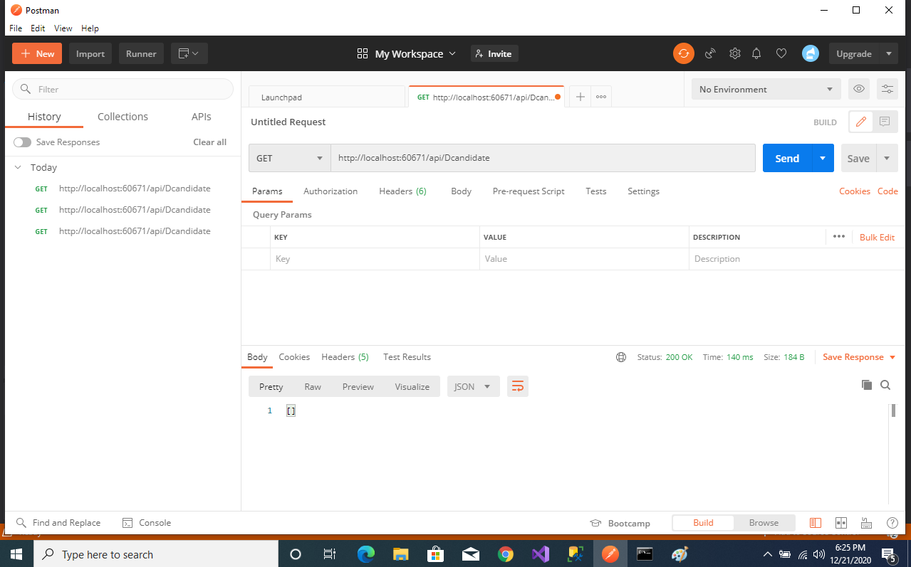
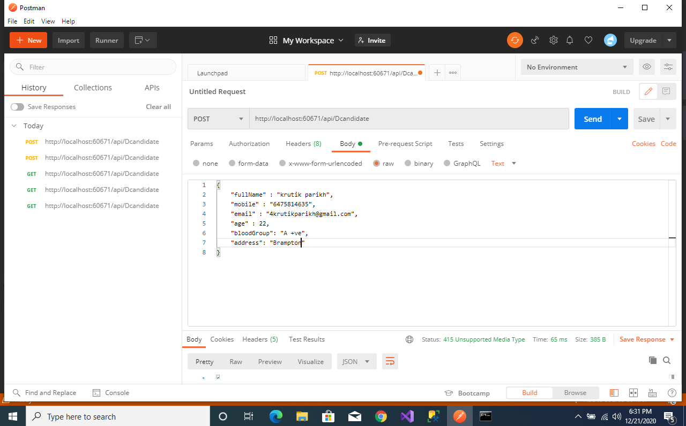
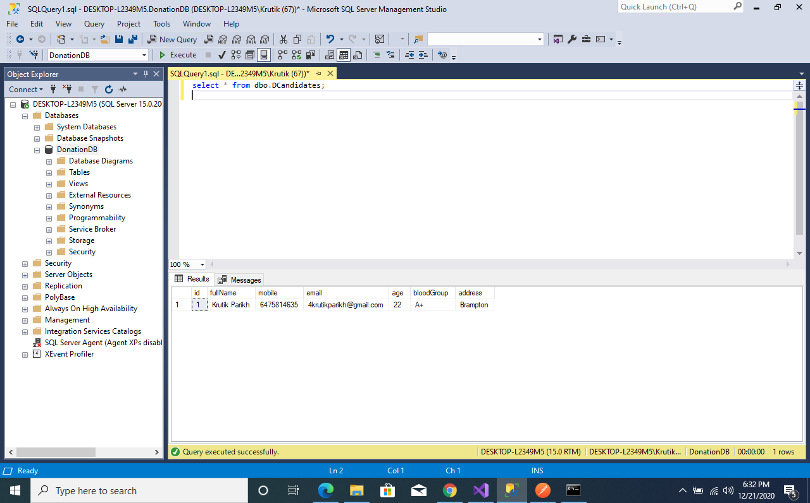
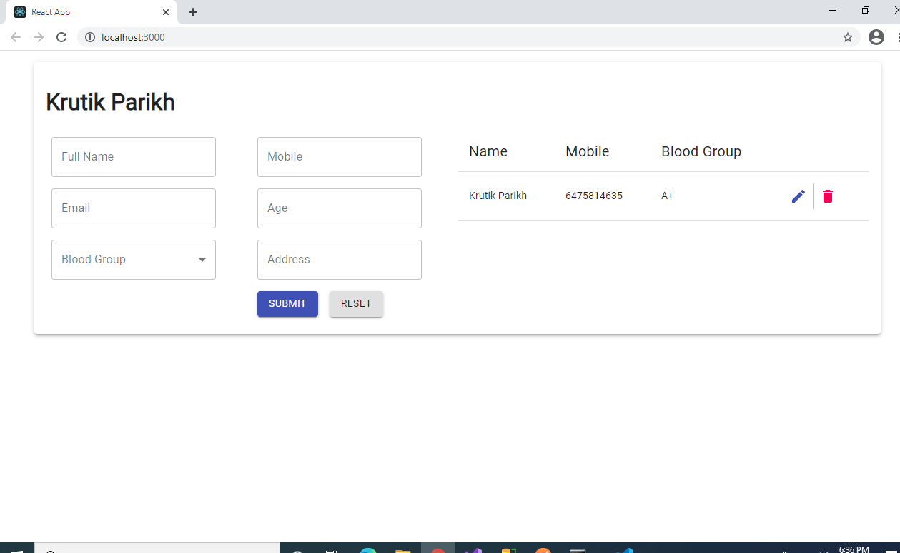

# Client with React and WebApi with C# and EntityFramework-SQL SERVER
## Frontend - 70% & Backend - 30%

### Frontend
- React
- Redux
- Redux-Thunk
- Material UI

### Backend
- Asp.Net Core web applcation
- Entity Framework
- SQL SERVER

Setup backend
```Run Backend on your Machine
Clone Repo
Change the Connection String in AppSetting.JSON
```

Setup Frontend
```Run Frontend on your Machine
Cd React-app
npm install
```

### Note - Change the BaseUrl of Frontend if you have published the backend

## Sample Images with Postman and SQL SERVER






 

